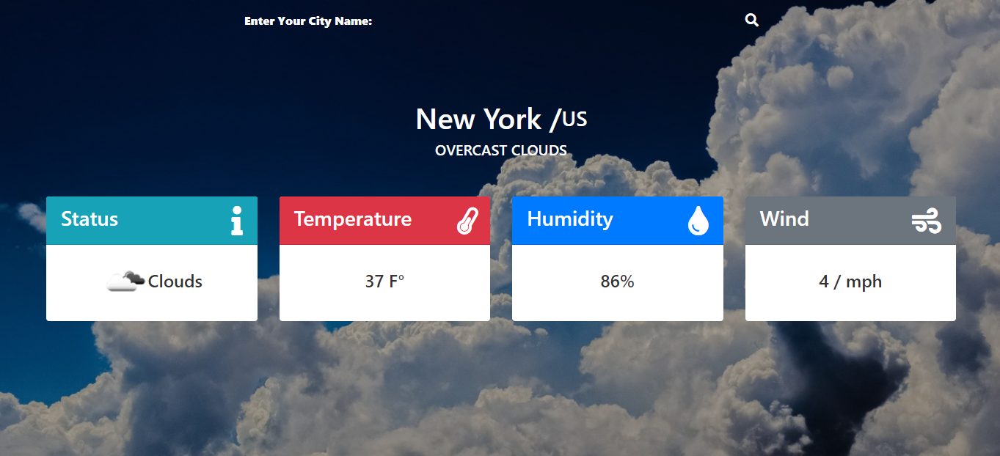

# weather-app

**A weather detector application with javascript, node.js and openWeatherMap API**



## Live Link

- Live: [DEMO](https://rawcdn.githack.com/MahmoudBakr23/weather-app/f83f5189391535c9fdc2a86829d8733a93982023/dist/index.html)

## Built with

- Pure JavaScript
- DOM properties and attributes
- HTML & SCSS
- openWeatherMap API

## Getting Started
To get a local copy of the repository please run the following commands on your terminal:
- ```$ cd <folder>```
- ```$ git clone https://github.com/MahmoudBakr23/weather-app.git ```
- ```$ cd weather-app ```
- ```$ npm run build ```
And finally open ./dist/index.html file in your browser.

## Authors

👤 **Mahmoud Bakr**
- Github: [@MahmoudBakr23](https://github.com/MahmoudBakr23)

- Linkedin: [Mahmoud Bakr](https://www.linkedin.com/in/m-bakr/)

- Email: [contact on Gmail](mbakr6821@gmail.com)

##    Contributing

Contributions, issues and feature requests are welcome!

## Show your support

Give a ⭐️ if you like this project!